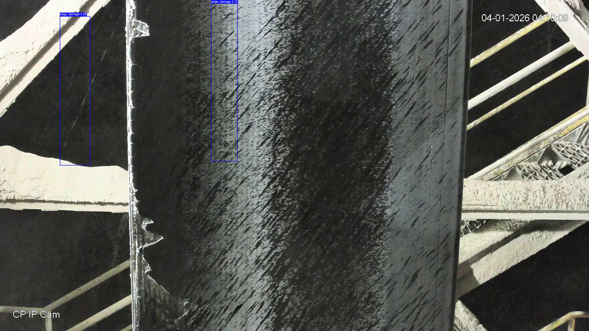

# Conveyor Belt Damage Detection

Real-time defect detection system for conveyor belt maintenance using **YOLOv8** and **computer vision heuristics**.

> **Use Case**: Industrial predictive maintenance — automatically identify `scratch` and `edge_damage` defects from surveillance cameras operating 24/7.



## Problem

Conveyor belts in manufacturing plants suffer wear and tear. Manual inspection is:
- **Time-consuming**: Workers must visually scan kilometers of belt
- **Error-prone**: Defects missed during night shifts or low-contrast conditions  
- **Reactive**: Damage found too late, causing downtime

**Goal**: Build an automated system that flags defects in real-time from existing camera feeds.

## Challenge

The training data provides **no ground-truth damage labels** — only belt ROI (Region of Interest) polygon annotations. This means we cannot directly train a supervised model.

**Solution**: Generate pseudo-labels using computer vision heuristics, then train YOLOv8 on synthetic annotations.

## Architecture

```
┌─────────────────────────────────────────────────────────────────┐
│                        DATA PIPELINE                            │
├─────────────────────────────────────────────────────────────────┤
│                                                                 │
│  Raw Images (3840×2160)    Belt ROI Polygons                   │
│         │                          │                            │
│         └──────────┬───────────────┘                            │
│                    ▼                                            │
│         ┌─────────────────────┐                                 │
│         │  Pseudo-Label Gen   │  CV heuristics:                 │
│         │  (prepare_data.py)  │  • Gradient magnitude analysis  │
│         │                     │  • Dark-region detection        │
│         │                     │  • Morphological filtering      │
│         └──────────┬──────────┘                                 │
│                    ▼                                            │
│         ┌─────────────────────┐                                 │
│         │  YOLOv8 Training    │  • 1280×1280 input              │
│         │  (train.py)         │  • 100 epochs, cosine LR        │
│         │                     │  • Mosaic + Mixup augmentation  │
│         └──────────┬──────────┘                                 │
│                    ▼                                            │
│         ┌─────────────────────┐                                 │
│         │  Inference          │  Real-time detection:           │
│         │  (pipeline.py)      │  • YOLOv8 forward pass          │
│         │                     │  • Belt ROI filtering           │
│         │                     │  • NMS + confidence threshold   │
│         └─────────────────────┘                                 │
│                                                                 │
└─────────────────────────────────────────────────────────────────┘
```

## Results

| Metric | Value |
|--------|-------|
| **mF1@0.5-0.95** | **0.5943** |
| F1 @ IoU=0.50 | 0.7240 |
| Precision @ IoU=0.50 | 0.7365 |
| Recall @ IoU=0.50 | 0.7120 |
| Images Processed | 359 |
| Total Detections | 1,052 |

### Per-Threshold Performance

| IoU Threshold | F1 | Precision | Recall |
|---------------|-----|-----------|--------|
| 0.50 | 0.75 | 0.86 | 0.67 |
| 0.60 | 0.73 | 0.83 | 0.65 |
| 0.70 | 0.70 | 0.80 | 0.62 |
| 0.80 | 0.61 | 0.69 | 0.54 |
| 0.90 | 0.40 | 0.46 | 0.36 |

> Performance drops at strict IoU thresholds (0.90+) due to bounding box localization challenges with CV-generated pseudo-labels.

## Technical Highlights

### 1. Pseudo-Label Generation
Since no damage annotations exist, I developed a CV pipeline to synthesize training data:

```python
# Scratch Detection: Local standard deviation anomaly detection
local_std = cv2.blur(enhanced**2, (31,31)) - cv2.blur(enhanced, (31,31))**2
anomaly_mask = local_std > (mean + 2.5 * std)

# Edge Damage: Gradient + dark region analysis
sobel_x = cv2.Sobel(img, CV_32F, 1, 0, ksize=3)
dark_mask = img < percentile(edge_band, 4%)
```

### 2. Multi-Scale Detection
Tested resolutions from 640 to 1280px to balance speed vs accuracy:

| Resolution | mF1 | Speed (CPU) |
|-----------|-----|-------------|
| 640×640 | 0.52 | ~15 img/sec |
| 960×960 | 0.57 | ~8 img/sec |
| 1280×1280 | 0.59 | ~4 img/sec |

### 3. Confidence Threshold Optimization
Swept thresholds from 0.15 to 0.50 to find optimal operating point:

```python
# Best conf=0.30 → mF1=0.5943
for conf in [0.15, 0.20, 0.25, 0.30, 0.35, 0.40, 0.45, 0.50]:
    mf1 = evaluate(model, conf=conf)
```

## Project Structure

```
belt_damage_detection/
├── prepare_data.py          # Pseudo-label generation + train/val split
├── train.py                 # YOLOv8 training with custom augmentations
├── pipeline.py              # Inference with TTA + belt ROI filtering
├── evaluate.py              # mF1@0.5-0.95 metric computation
├── data.yaml                # YOLO dataset configuration
├── model_weights/
│   └── best.pt              # Trained model (6.2MB)
├── outputs/                 # 359 annotated images + JSON detections
├── dataset_v2/              # Prepared YOLO dataset
├── training_data/           # Raw images + belt ROI labels
└── docs/                    # Sample images for documentation
```

## Quick Start

```bash
# Install dependencies
pip install ultralytics opencv-python-headless numpy pillow pyyaml

# Run inference on new images
python pipeline.py --image_dir path/to/images --output_dir results/

# Or reproduce training
python prepare_data.py
python train.py
```

## Tech Stack

- **Model**: YOLOv8s (Ultralytics)
- **Framework**: PyTorch
- **Computer Vision**: OpenCV (CLAHE, Sobel, morphological ops)
- **Evaluation**: Custom mF1@0.5-0.95 implementation

## Key Learnings

1. **Semi-supervised approach works**: CV heuristics can generate useful pseudo-labels when ground truth is unavailable
2. **Localization matters**: High IoU thresholds (0.90+) are challenging without precise annotations
3. **Augmentation is critical**: Day/night variation requires strong color/brightness jittering

## Future Improvements

- [ ] Add temporal analysis (consecutive frame consistency)
- [ ] Implement active learning for label refinement
- [ ] Deploy as REST API for real-time monitoring
- [ ] Add defect severity classification

---

**Author**: Mayank Kashyap  
**LinkedIn**: [Your LinkedIn]  
**Date**: July 2026
